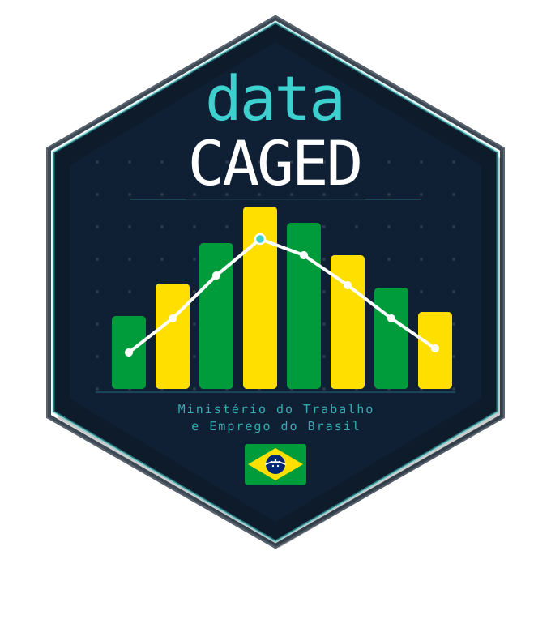

# datacaged 

*[Leia em Português](README.pt-BR.md)*

[](https://github.com/gecomt/datacaged/actions)
[](https://app.codecov.io/gh/gecomt/datacaged)
[](LICENSE.md)
[](https://doi.org/10.5281/zenodo.20058818)
[](https://CRAN.R-project.org/package=datacaged)
[](https://cran.r-project.org/web/checks/check_results_datacaged.html)
[](https://cran.r-project.org/package=datacaged)


> CAGED microdata straight into your 'DuckDB', with a complete pipeline ready for analysis.

**datacaged** is an R package that automates the entire workflow with CAGED (Cadastro Geral de Empregados e Desempregados — Brazil's General Register of Employed and Unemployed Workers) microdata. Data is downloaded from a [HuggingFace repository](https://huggingface.co/datasets/alexsandroprado/caged) via HTTPS, parsed with streaming decompression, and stored in a local 'DuckDB' database for fast, scalable queries with `dplyr` or SQL.

---

## ✨ Key features

* 📥 Automated download from HuggingFace (HTTPS — no FTP required)
* ⚡ Parallel downloads (`workers = 3` by default)
* 📦 Stream decompression of `.7z` files — no temporary disk extraction
* 🗄️ Efficient storage in a local **'DuckDB'** database
* 🔄 Full pipeline in a single function call
* 📊 Integration with `dplyr` for data analysis
* 🖥️ **Compatible with Windows, macOS and Linux**
* 🧩 Support for multiple datasets:

  * Novo CAGED (2020+)
  * Legacy CAGED (1992–2019)
  * CAGED Adjustments (historical corrections)

---

## 🚀 Installation

```r
# install.packages("remotes")
remotes::install_github("gecomt/datacaged")
```

---

## 🖥️ Platform compatibility

| Feature | Windows | macOS | Linux |
|---|---|---|---|
| Download (HTTPS) | ✅ | ✅ | ✅ |
| Parallel downloads | ✅ | ✅ | ✅ |
| Novo CAGED (2020+, LZMA) | ✅ | ✅ | ✅ |
| Legacy CAGED (pre-2020, PPMd) | ⚠️ | ⚠️ | ⚠️ |
| DuckDB | ✅ | ✅ | ✅ |

**Legacy CAGED (pre-2020)** uses PPMd compression which requires 7-Zip. **Novo CAGED (2020+) works on all platforms without any extra software.**

### Installing 7-Zip (only needed for pre-2020 data)

**Windows** — install the [7-Zip installer](https://www.7-zip.org/download.html) (standard installation to `C:\Program Files\7-Zip` is automatically detected).

**macOS**

```sh
brew install 7-zip
```

**Linux (Debian/Ubuntu)**

```sh
sudo apt install 7zip
```

**Linux (Fedora/RHEL)**

```sh
sudo dnf install 7zip
```

---

## ⚡ Quick start

```r
library(datacaged)

# Full pipeline — downloads, parses and writes to DuckDB
caged_load(
  years   = 2022:2023,
  months  = seq_len(12L),
  db_path = file.path(tempdir(), "caged.duckdb")
)

# Connect and query
con <- caged_connect(file.path(tempdir(), "caged.duckdb"))

library(dplyr)

tbl(con, "caged_mov") |>
  filter(uf == 35, competenciamov >= 202201L) |>
  group_by(competenciamov) |>
  summarise(saldo = sum(saldomovimentacao, na.rm = TRUE)) |>
  collect()

DBI::dbDisconnect(con, shutdown = TRUE)
```

---

## ⚙️ Performance

```r
# Parallel downloads (default: 3 workers)
caged_download(years = 2023, months = 1:12, workers = 3)

# Sequential (for slow connections or debugging)
caged_download(years = 2023, months = 1:12, workers = 1)

# Set globally
options(datacaged.workers = 4)
```

Parallel downloads process MOV, FOR and EXC files simultaneously per month — approximately **3× faster** than sequential for Novo CAGED.

---

## 🧠 Pipeline

```
HuggingFace (HTTPS)
      ↓
  caged_download()   ← parallel, with local cache
      ↓
  caged_parse()      ← stream decompression via archive_read()
      ↓
  caged_to_duckdb()  ← bulk insert, deduplication by period
      ↓
  caged_connect()    ← dplyr / SQL / DBI
```

---

## 📚 Main functions

| Function | Description |
|---|---|
| `caged_load()` | Full pipeline (download → parse → DuckDB) |
| `caged_adjustments_load()` | Adjustments pipeline |
| `caged_download()` | Download `.7z` files with cache |
| `caged_download_layouts()` | Download official MTE layouts |
| `caged_parse()` | Parse a single `.7z` file |
| `caged_parse_batch()` | Batch parse |
| `caged_to_duckdb()` | Write to DuckDB |
| `caged_connect()` | Open DBI connection |
| `caged_info()` | Database statistics |
| `caged_status()` | Check HuggingFace connectivity |
| `caged_hf_files()` | List available competencies |
| `caged_update()` | Download only new competencies |
| `caged_to_parquet()` | Export tables to Parquet files |

---

## 🗄️ Database tables

| Table | Content | Period |
|---|---|---|
| `caged_mov` | Movements | 2020+ |
| `caged_for` | Late declarations | 2020+ |
| `caged_exc` | Exclusions | 2020+ |
| `caged_antigo` | Historical data | 1992–2019 |
| `caged_ajustes` | Retroactive adjustments | 1992–2019 |

---

## 🧾 Requirements

* R ≥ 4.2.0
* 7-Zip *(optional — only required for CAGED pre-2020 with PPMd compression)*

---

## 📊 Use cases

* Labour market analysis
* Economic indicators
* Academic research
* Formal employment monitoring
* Econometric modelling

---

## 📄 Licence

MIT © Alexsandro Prado

---

## 📬 Contact

**Author:** Alexsandro Prado  
**Email:** [alexsandro.prado@ufersa.edu.br](mailto:alexsandro.prado@ufersa.edu.br)  
**GitHub:** <https://github.com/gecomt/datacaged>
